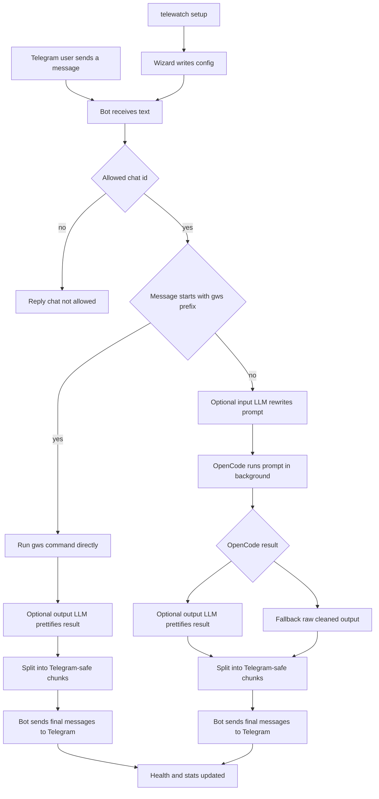

# Telegram OpenCode Bridge

Minimal Telegram application that forwards a chat message to `opencode`, waits for the result, and sends the final output back to the same chat.

The recommended workflow is the built-in setup wizard. It collects the bot token, model, working dir, timeout, allowed chat ids, log level, and optional LLM settings for both input prompt enhancement and output prettification, then writes the config file for you.

## What Was Introduced

- Wizard-first app setup with background execution, status/stop controls, and systemd helper commands.
- Dual LLM pipeline:
    - input prompt enhancement before OpenCode execution
    - output prettification for Telegram delivery
- OpenCode reliability fallback chain when the primary model is quota-limited.
- Google Workspace Option A integration:
    - direct command execution via `!gws ...` in chat text
    - direct command execution via `/gws ...` command
- Runtime observability with `/health` and `/stats`.
- Security hardening:
    - token redaction in logs
    - setup wizard hides sensitive defaults (token/API keys/chat allowlist counts)
    - repository examples use placeholders instead of real credentials

## Workflow Diagram



## Quick Start

1. Run `telewatch setup`.
2. Follow the wizard and let it write `~/.config/telewatch/bridge.env` for you.
3. Choose whether to start the app immediately.
4. Use `telewatch start` for the normal background run.
5. Use `telewatch start --foreground --debug` when you want to watch the bridge interactively.

## Install

```bash
cd /home/DevCrewX/Projects/TelegramRemoteProgressBot
source .venv/bin/activate
./.venv/bin/python -m pip install -e .
```

## Setup Wizard

The wizard is the normal way to configure the app. It is the fastest route for first run and the easiest way to change token, model, or chat restrictions later.

The wizard writes a config file at `~/.config/telewatch/bridge.env`. You do not need to edit it by hand unless you want to.

The wizard configures:

- Telegram bot token
- OpenCode model
- OpenCode working directory
- timeout seconds
- Google Workspace credentials file (optional)
- gws command timeout seconds
- allowed chat ids
- log level
- optional decorated-output settings

LLM stages:

- Input LLM: rewrites raw Telegram prompts into better OpenCode prompts while preserving intent.
- Output LLM: formats OpenCode results into concise Telegram-friendly sections.

For each stage, the wizard lets you choose:

- `litellm`: provide model name and port (default `8000`, OpenAI-compatible local gateway)
- `api`: provide API key, model, and OpenAI-compatible base URL

Google Workspace command paths (Option A):

- `!gws <subcommand> [args]` in normal chat text
- `/gws <subcommand> [args]` as a Telegram bot command

Examples:

```text
!gws drive files list --params '{"pageSize":10}'
/gws gmail labels list
```

If you want to bootstrap from the shell for reference, [config/opencode-bridge.env.example](config/opencode-bridge.env.example) shows the same keys the wizard manages.

If you want systemd supervision, use [config/telewatch.service.example](config/telewatch.service.example) as the starting point, or let `telewatch install-systemd` create the user unit for you.

Optional decorated output post-processor settings:

```bash
export TELEWATCH_INPUT_LLM_ENABLED="1"
export TELEWATCH_INPUT_LLM_PROVIDER="litellm"
export TELEWATCH_INPUT_LLM_MODEL="groq-gpt-oss-mini"
export TELEWATCH_INPUT_LLM_LITELLM_PORT="8000"

export TELEWATCH_OUTPUT_LLM_ENABLED="1"
export TELEWATCH_OUTPUT_LLM_PROVIDER="litellm"
export TELEWATCH_OUTPUT_LLM_MODEL="groq-gpt-oss-mini"
export TELEWATCH_OUTPUT_LLM_LITELLM_PORT="8000"
```

## Run

```bash
telewatch setup
telewatch start
```

The app runs in the background by default. For interactive debugging:

```bash
telewatch start --foreground --debug
```

## Systemd

Install the user systemd service after setup:

```bash
telewatch install-systemd --start
```

Write the unit without enabling it:

```bash
telewatch install-systemd --no-enable
```

Remove the unit later with:

```bash
telewatch uninstall-systemd
```

Logs are written to `~/.config/telewatch/telewatch.log`.
Sensitive Telegram API tokens are redacted from those logs.

Status commands:

```bash
telewatch status
telewatch stop
```

## Bot Commands

Telegram commands available from the bot:

```text
/start
/help
/health
/stats
/gws
```

`/health` reports whether the bridge is healthy and configured, and `/stats` reports runtime counters for received prompts, completed jobs, failures, and quota fallbacks.

## Test

```bash
./.venv/bin/python -m unittest discover -s tests -p 'test_*.py'
```

## Notes

- The bot is intentionally small and single-purpose.
- This branch exposes the application and the bridge command.
- If the configured model hits quota or rate limits, the bridge automatically retries with `opencode/minimax-m2.5-free` and then `opencode/nemotron-3-super-free`.
- If the output LLM is enabled and healthy, replies are reformatted into Telegram-friendly HTML sections.
- `telewatch install-systemd` writes a user unit to `~/.config/systemd/user/telewatch.service` and enables it unless you pass `--no-enable`.
- `telewatch uninstall-systemd` removes that user unit and reloads the user systemd daemon.
