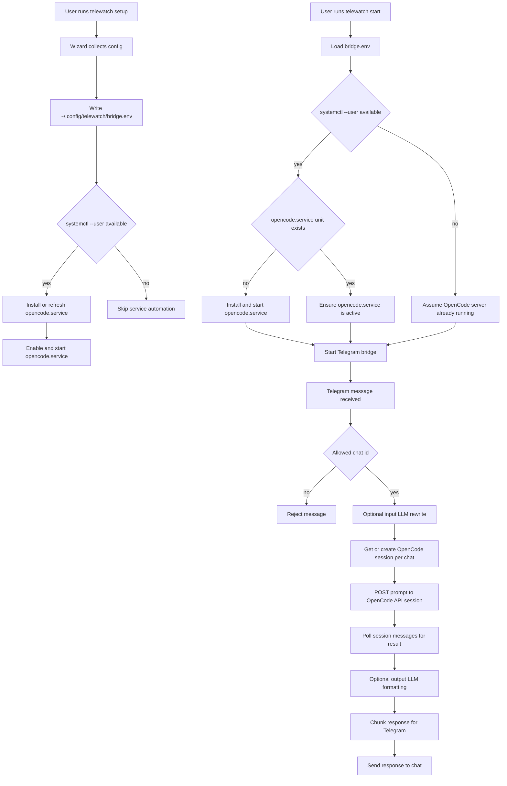
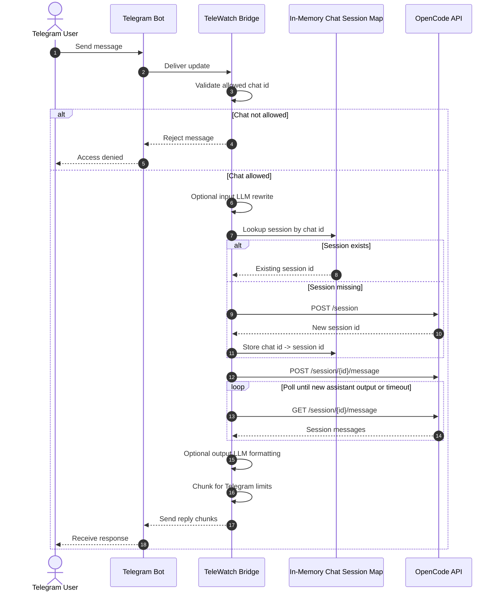

# Telegram OpenCode API Bridge

Minimal Telegram application that forwards messages to an OpenCode API server (`opencode serve`), waits for completion, and returns results to the same Telegram chat.

## Architecture

- API-first runtime: no per-message OpenCode subprocess calls.
- One OpenCode session per Telegram chat for conversational continuity.
- Optional dual LLM pipeline:
  - input prompt enhancement before OpenCode submission
  - output prettification before Telegram delivery
- Runtime observability via `/health` and `/stats`.
- Telegram token redaction in logs.

## Workflow Diagram



## Message Execution Sequence



## End-to-End Flow

1. `telewatch setup` runs an interactive wizard and writes `~/.config/telewatch/bridge.env`.
2. If user systemd is available, setup installs or refreshes `opencode.service` and starts it.
3. `telewatch start` loads config and ensures `opencode.service` is running before starting the bridge.
4. Telegram messages are validated against the optional chat allowlist.
5. The bridge optionally rewrites prompts using the input LLM role.
6. The bridge sends prompts to the OpenCode API session tied to that Telegram chat.
7. The bridge waits for the response, optionally decorates output, chunks text, and replies.

Session behavior:

- Each Telegram chat gets one in-memory OpenCode session while the bridge process is alive.
- A bridge restart clears that in-memory mapping, so new sessions are created after restart.

## Quick Start

1. Install dependencies and package:

```bash
cd /home/DevCrewX/Projects/TelegramRemoteProgressBot
source .venv/bin/activate
./.venv/bin/python -m pip install -e .
```

2. Configure TeleWatch:

```bash
telewatch setup
```

`telewatch setup` writes the bridge config and installs the user OpenCode service from the same env file when `systemctl --user` is available.

3. Run the bot:

```bash
telewatch start
```

`telewatch start` verifies that `opencode.service` is up before launching the Telegram bridge.

For foreground debugging:

```bash
telewatch start --foreground --debug
```

## Command Lifecycle

`telewatch setup`:

- collects all config values
- writes env file
- installs and starts OpenCode user service when possible
- optionally launches the bridge immediately

`telewatch start`:

- validates config and working directory
- ensures OpenCode service is installed/running when user systemd is available
- starts bridge in background by default, or foreground with `--foreground`

`telewatch install-systemd`:

- writes both `telewatch.service` and `opencode.service`
- can enable and optionally start both services

`telewatch uninstall-systemd`:

- disables both services
- removes both unit files from user systemd directory

## Setup Wizard

`telewatch setup` writes `~/.config/telewatch/bridge.env` and configures:

- Telegram bot token
- OpenCode model and working directory
- OpenCode API URL/auth/timeout
- OpenCode server username/password for the `opencode.service` unit
- Telegram allowed chat IDs
- log level
- optional input/output LLM roles

For each LLM role:

- `litellm`: model + LiteLLM port
- `api`: API key + model + OpenAI-compatible base URL

The wizard stores only non-empty values for known keys and writes file mode `0600` for config safety.

Reference files:

- [config/opencode-bridge.env.example](config/opencode-bridge.env.example)
- [config/example.yaml](config/example.yaml)
- [config/opencode.service.example](config/opencode.service.example)
- [config/telewatch.service.example](config/telewatch.service.example)

## Configuration Keys

Core runtime:

- `TELEGRAM_BOT_TOKEN`
- `OPENCODE_MODEL`
- `OPENCODE_WORKING_DIR`
- `OPENCODE_TIMEOUT_SECONDS`
- `OPENCODE_MAX_CONCURRENT`
- `OPENCODE_API_BASE_URL`
- `OPENCODE_API_USERNAME`
- `OPENCODE_API_PASSWORD`
- `OPENCODE_API_TIMEOUT_SECONDS`
- `TELEGRAM_ALLOWED_CHAT_IDS`
- `LOG_LEVEL`

OpenCode daemon automation:

- `OPENCODE_SERVER_USERNAME`
- `OPENCODE_SERVER_PASSWORD`

Optional LLM roles:

- `TELEWATCH_INPUT_LLM_*`
- `TELEWATCH_OUTPUT_LLM_*`

Legacy compatibility:

- `TELEWATCH_DECORATOR_*` (supported, but output role keys are preferred)

## OpenCode API Auth

If your OpenCode server uses basic auth:

```bash
export OPENCODE_SERVER_USERNAME="opencode"
export OPENCODE_SERVER_PASSWORD="<strong-password>"
opencode serve --hostname 127.0.0.1 --port 4096
```

Then set matching values in `telewatch setup` for:

- `OPENCODE_API_USERNAME`
- `OPENCODE_API_PASSWORD`

If you want the wizard to manage the OpenCode daemon automatically, also provide:

- `OPENCODE_SERVER_USERNAME`
- `OPENCODE_SERVER_PASSWORD`

Note: the same env file is used by both bridge and OpenCode user services.

## Bot Commands

Available Telegram commands:

```text
/start
/help
/health
/stats
```

No direct `!gws`/`/gws` execution path exists in this architecture. Google Workspace actions should run through MCP tools configured in your OpenCode server.

## Runtime Behavior and Reliability

- Bridge startup fails fast if configured working directory does not exist.
- If `systemctl --user` is present, startup attempts to ensure OpenCode service availability before the Telegram bridge starts.
- If `systemctl --user` is not present, bridge assumes OpenCode server is already running externally.
- Health and stats commands expose service and request-level visibility.
- Token-like Telegram strings are redacted from logs.

## Systemd (User Service)

`telewatch setup` installs the OpenCode service automatically when `systemctl --user` is available.

Install and start the TeleWatch bridge service:

```bash
telewatch install-systemd --start
```

Install without enabling:

```bash
telewatch install-systemd --no-enable
```

Remove service:

```bash
telewatch uninstall-systemd
```

The OpenCode service is kept in [config/opencode.service.example](config/opencode.service.example) and is managed through the same user systemd directory.

Effective unit placement:

- `~/.config/systemd/user/opencode.service`
- `~/.config/systemd/user/telewatch.service`

## Logging and Status

- Log file: `~/.config/telewatch/telewatch.log`
- Token redaction is enabled for Telegram bot token patterns.
- Local status commands:

```bash
telewatch status
telewatch stop
```

Useful user-systemd checks:

```bash
systemctl --user status opencode.service
systemctl --user status telewatch.service
journalctl --user -u opencode.service -n 100 --no-pager
journalctl --user -u telewatch.service -n 100 --no-pager
```

## Testing

```bash
./.venv/bin/python -m unittest discover -s tests -p 'test_*.py'
```

## Migration Notes

If upgrading from older branches:

- Prompt execution now goes through OpenCode API sessions.
- Legacy monitor/analyzer YAML workflows are removed from runtime.
- Direct Telegram-side GWS command execution was removed.
- `TELEWATCH_DECORATOR_*` variables are still accepted for compatibility, but `TELEWATCH_OUTPUT_LLM_*` is preferred.
- OpenCode context is kept per Telegram chat within the running bridge process, but it is not persisted across restarts.

## Notes

- The bot remains intentionally small and single-purpose.
- `subprocess.run` exists only in CLI management commands for systemd install/uninstall, not in prompt execution.
