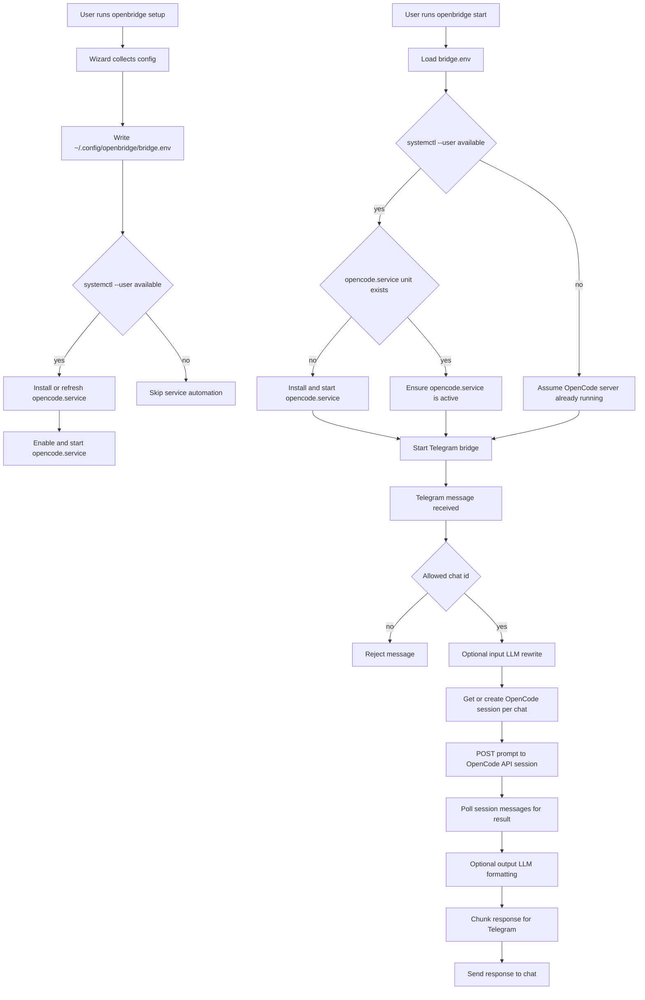
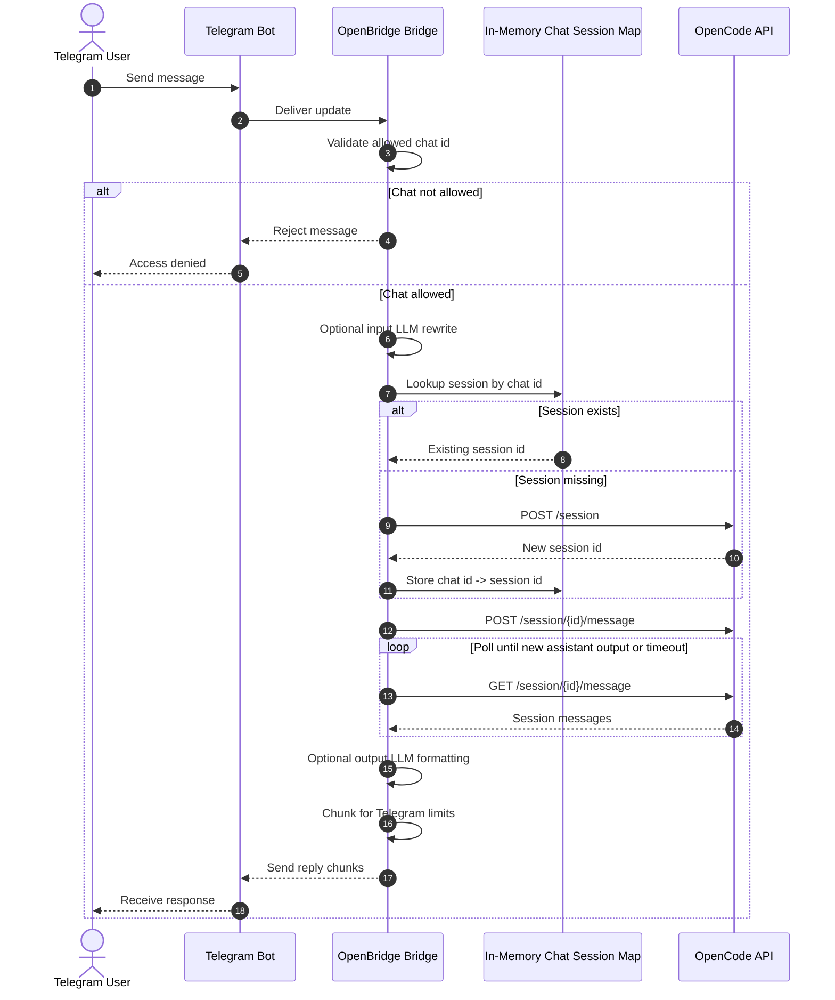
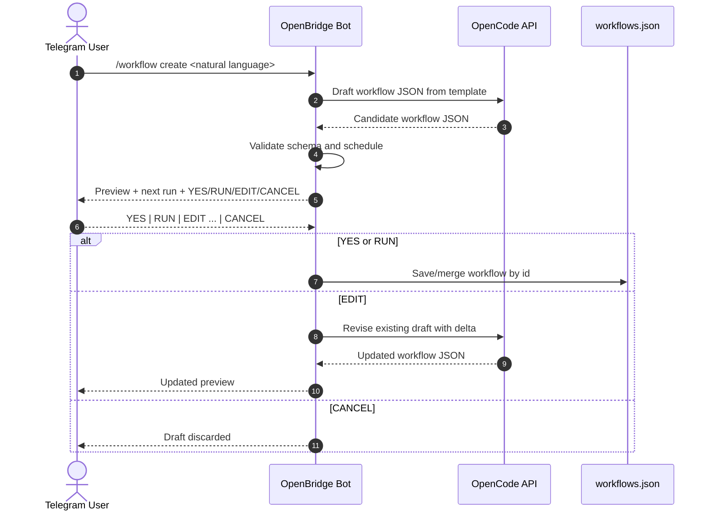
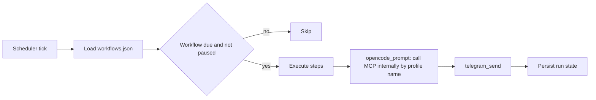

# Telegram OpenCode API Bridge

Minimal Telegram application that forwards messages to an OpenCode API server (`opencode serve`), waits for completion, and returns results to the same Telegram chat.

## Architecture

### Design Principles
- **API-first runtime**: no per-message OpenCode subprocess calls.
- **Session continuity**: one OpenCode session per Telegram chat for conversational context.
- **Layered services**: focused modules with clear responsibilities.
- **Observability**: runtime health checks and stats via `/health` and `/stats`.
- **Security**: Telegram token redaction in logs, configuration isolation.

### Module Structure
The bridge is organized into focused, composable services:

#### 1. **Core Bridge** (`OpenCodeBridge`)
- Composition root: coordinates all services
- Telegram message handling and dispatch
- Per-chat task queuing with overflow management
- Session lifecycle management
- Statistics tracking and health reporting
- Workflow management (drafting, authoring, execution)

#### 2. **OpenCode API Client** (`OpenCodeAPIClient`)
- Encapsulates all OpenCode API interactions
- Session creation and lifecycle
- Message posting and retrieval
- Adaptive backoff with jitter for polling (configurable)
- Error handling and retry semantics

#### 3. **LLM Service** (`LLMService`)
- Input prompt enhancement via configurable LLM
- Output decoration and formatting via configurable LLM
- JSON response parsing and validation
- Graceful fallback on LLM errors

#### 4. **Message Formatting & Rendering**
- Telegram MarkdownV2 escaping and safe chunking
- Response decoration and sectioning
- Text truncation for Telegram limits

#### 5. **Workflow Management** (internal to bridge)
- Workflow definition authoring (from natural language prompts)
- Workflow scheduling and execution via cron/intervals
- Workflow persistence (JSON file based)

#### 6. **Configuration** (`BridgeConfig`)
- Centralized environment variable parsing
- Validation of all configuration knobs
- Runtime-accessible settings for all services

### Data Flow

```
Telegram → OpenBridge (dispatcher) → OpenCodeAPIClient (session/polling)
                              ↓
                         LLMService (enhancement/decoration)
                              ↓
                         Message formatting & chunking
                              ↓
                         Telegram
```

### Optional Features (Dual LLM Pipeline)
- **Input stage**: Optional prompt enhancement before OpenCode submission (improves quality)
- **Output stage**: Optional output prettification before Telegram delivery (better readability)

### Modularization Roadmap

**Phase 1** (✅ Complete): Extract focused service modules
- LLMService: Encapsulates all LLM operations
- OpenCodeAPIClient: Encapsulates all API operations
- Module boundaries clearly established

**Phase 2** (Planned): Full integration and simplification
- Integrate services into OpenCodeBridge as composition root
- Extract rendering module (message formatting, chunking)
- Extract workflow module (authoring, scheduling, execution)
- Extract stats/telemetry module
- Remove redundant code from main bridge class

### Configuration Knobs
All services respect centralized environment configuration:
- `OPENBRIDGE_OPENCODE_BACKOFF_*`: Adaptive backoff strategy for polling
- `OPENBRIDGE_CHAT_QUEUE_*`: Per-chat task queue limits and overflow behavior
- `OPENBRIDGE_WORKFLOW_PROMPT_*`: Workflow prompt size bounds and overflow handling
- `OPENBRIDGE_INPUT_LLM_*` / `OPENBRIDGE_OUTPUT_LLM_*`: LLM runtime configuration

## Screenshots

### OpenBridge CLI / TUI Startup


### Telegram Chat Output


## Workflow Diagram



## Message Execution Sequence



## End-to-End Flow

1. `openbridge setup` runs an interactive wizard and writes `~/.config/openbridge/bridge.env`.
2. If user systemd is available, setup installs or refreshes `opencode.service` and starts it.
3. `openbridge start` loads config and ensures `opencode.service` is running before starting the bridge.
4. Telegram messages are validated against the optional chat allowlist.
5. The bridge optionally rewrites prompts using the input LLM role.
6. The bridge sends prompts to the OpenCode API session tied to that Telegram chat.
7. The bridge waits for the response, optionally decorates output, chunks text, and replies.

Session behavior:

- Each Telegram chat gets one in-memory OpenCode session while the bridge process is alive.
- A bridge restart clears that in-memory mapping, so new sessions are created after restart.

## Quick Start

1. Install dependencies and package:

```bash
cd /home/DevCrewX/Projects/TelegramRemoteProgressBot
source .venv/bin/activate
./.venv/bin/python -m pip install -e .
./.venv/bin/python -m pip install -r requirements-dev.txt
```

2. Configure OpenBridge:

```bash
openbridge setup
```

`openbridge setup` writes the bridge config and installs the user OpenCode service from the same env file when `systemctl --user` is available.
Before enabling the service, run `openbridge deploy-validate --workspace <repo-root>` to check config completeness, service path safety, and allowlist semantics.

3. Run the bot:

```bash
openbridge start
```

`openbridge start` verifies that `opencode.service` is up before launching the Telegram bridge.

For foreground debugging:

```bash
openbridge start --foreground --debug
```

## Local Precheck

Run this before pushing changes:

```bash
bash scripts/preflight.sh
```

The script is pinned to `./.venv/bin/python` and fails fast if the project venv is missing.
By default it runs validation only (no dependency install), which avoids mutating global interpreters.
If you need to install/update dev dependencies first, run:

```bash
bash scripts/preflight.sh --install
```

Validation covers type checks (`mypy`), tests, and package build checks.
Current static gates target type checks on `src/openbridge/workflows.py`.
It also runs a config/docs drift check to keep runtime-sensitive defaults aligned with `config/opencode-bridge.env.example` and `config/example.yaml`.

## Install From Release Artifacts (Linux)

If you do not want to clone this repository, you can install OpenBridge directly from the GitHub release artifacts.

Release page:

- [OpenBridge v1.0.1 release](https://github.com/ArindamTripathi619/TelegramRemoteProgressBot/releases/tag/v1.0.1)

Direct artifact links:

- [openbridge-1.0.1-py3-none-any.whl](https://github.com/ArindamTripathi619/TelegramRemoteProgressBot/releases/download/v1.0.1/openbridge-1.0.1-py3-none-any.whl)
- [openbridge-1.0.1.tar.gz](https://github.com/ArindamTripathi619/TelegramRemoteProgressBot/releases/download/v1.0.1/openbridge-1.0.1.tar.gz)

Prerequisites:

- Python 3.8+ (3.10+ recommended)
- A Telegram bot token from BotFather
- OpenCode CLI and runtime dependencies (`npm`, `opencode`, etc.)

Install using wheel (recommended):

```bash
python3 -m venv .venv
source .venv/bin/activate
python -m pip install --upgrade pip
python -m pip install ./openbridge-1.0.1-py3-none-any.whl
```

Install using source tarball:

```bash
tar -xzf openbridge-1.0.1.tar.gz
cd openbridge-1.0.1
python3 -m venv .venv
source .venv/bin/activate
python -m pip install --upgrade pip
python -m pip install .
```

First run:

```bash
openbridge setup
openbridge start
```

Useful commands:

```bash
openbridge status
openbridge stop
openbridge --version
```

## Command Lifecycle

`openbridge setup`:

- collects all config values
- writes env file
- installs and starts OpenCode user service when possible
- optionally launches the bridge immediately

`openbridge start`:

- validates config and working directory
- ensures OpenCode service is installed/running when user systemd is available
- starts bridge in background by default, or foreground with `--foreground`

`openbridge install-systemd`:

- writes both `openbridge.service` and `opencode.service`
- can enable and optionally start both services
- generated units use `TimeoutStartSec=2min`, `TimeoutStopSec=30s`, `RestartSec=5s`, `StartLimitIntervalSec=60s`, `StartLimitBurst=5`, and `StartLimitAction=none`
- watchdog support is disabled by default (`WatchdogSec=0`) because the services do not emit watchdog keepalive notifications
- under repeated startup failures, systemd backs off for 5 seconds between restarts and then leaves the unit failed once the burst limit is hit

`openbridge uninstall-systemd`:

- disables both services
- removes both unit files from user systemd directory
- run `openbridge deploy-validate --workspace <repo-root>` before enabling the service to catch missing config or path issues early

`openbridge workflows`:

- manages recurring automation definitions stored in `~/.config/openbridge/workflows.json`
- `init` writes a sample daily news workflow
- `list` shows workflow status, schedule, and next run time
- `status --id <workflow>` shows persisted state for one workflow
- `validate` checks the workflow file for schema and syntax errors
- `run --id <workflow>` executes one workflow immediately using the configured bot and OpenCode bridge
- `pause --id <workflow>` and `resume --id <workflow>` control scheduler execution without editing definitions
- `opencode_prompt` workflow steps are bounded by `OPENBRIDGE_WORKFLOW_PROMPT_MAX_CHARS`
- set `OPENBRIDGE_WORKFLOW_PROMPT_OVERFLOW_MODE=truncate` to truncate oversized generated prompts instead of rejecting them

Workflow definitions are JSON-based so the app can load, validate, and execute them without extra dependencies.
Supported schedules include `daily@HH:MM`, `every:<seconds>` / `interval:<seconds>`, and cron-style expressions (`cron:*/15 * * * *`).
The `http_fetch` step now supports RSS/Atom normalization for news workflows via `normalize: "rss_digest"` (or `auto`).

Phase-1 execution model for Google Workspace workflows:

- use `opencode_prompt` + `telegram_send` to ship quickly
- instruct OpenCode in the prompt to use the desired MCP profile internally (for example `gws-arindam` or `gws-kiit`)
- keep scheduler/state/retries in OpenBridge





Template examples:

- [config/workflows.example.json](config/workflows.example.json)
- [config/workflow-templates/personal-gmail-digest.opencode-internal-mcp.json](config/workflow-templates/personal-gmail-digest.opencode-internal-mcp.json)

## Setup Wizard

`openbridge setup` writes `~/.config/openbridge/bridge.env` for the bridge and `~/.config/openbridge/opencode.env` for the OpenCode service, then configures:

- preflight check for required CLI tools (`npm`, `npx`, `opencode`, `gws`, `gws-mcp-server`)
- optional install prompt for missing dependencies

- Telegram bot token
- OpenCode model and working directory
- OpenCode API URL/auth/timeout
- per-chat queue depth and overflow policy for burst control
- OpenCode server username/password for the `opencode.service` unit
- Telegram allowed chat IDs
- log level
- optional input/output LLM roles

For each LLM role:

- `litellm`: model + LiteLLM port
- `api`: API key + model + OpenAI-compatible base URL

The wizard stores only non-empty values for known keys and writes file mode `0600` for config safety.

Reference files:

- [config/opencode-bridge.env.example](config/opencode-bridge.env.example)
- [config/example.yaml](config/example.yaml)
- [config/opencode.service.example](config/opencode.service.example)
- [config/openbridge.service.example](config/openbridge.service.example)

## Configuration Keys

Core runtime:

- `TELEGRAM_BOT_TOKEN`
- `OPENCODE_MODEL`
- `OPENCODE_WORKING_DIR`
- `OPENCODE_TIMEOUT_SECONDS`
- `OPENCODE_MAX_CONCURRENT`
- `OPENCODE_API_BASE_URL`
- `OPENCODE_API_USERNAME`
- `OPENCODE_API_PASSWORD`
- `OPENCODE_API_TIMEOUT_SECONDS`
- `OPENBRIDGE_CHAT_QUEUE_MAX_PENDING`
- `OPENBRIDGE_CHAT_QUEUE_OVERFLOW_MODE` (`reject` by default; `drop_oldest` keeps the latest prompt instead)
- `TELEGRAM_ALLOWED_CHAT_IDS`
- `TELEGRAM_ALLOW_ALL_CHATS` (default `0`; when `0` and allowlist is empty, all chats are denied)
- `LOG_LEVEL`

OpenCode daemon automation:

- `OPENCODE_SERVER_USERNAME`
- `OPENCODE_SERVER_PASSWORD`

Optional LLM roles:

- `OPENBRIDGE_INPUT_LLM_*`
- `OPENBRIDGE_OUTPUT_LLM_*`

Legacy compatibility:

- `OPENBRIDGE_DECORATOR_*` (supported, but output role keys are preferred)

## OpenCode API Auth

If your OpenCode server uses basic auth:

```bash
export OPENCODE_SERVER_USERNAME="opencode"
export OPENCODE_SERVER_PASSWORD="<strong-password>"
opencode serve --hostname 127.0.0.1 --port 4096
```

Then set matching values in `openbridge setup` for:

- `OPENCODE_API_USERNAME`
- `OPENCODE_API_PASSWORD`

If you want the wizard to manage the OpenCode daemon automatically, also provide:

- `OPENCODE_SERVER_USERNAME`
- `OPENCODE_SERVER_PASSWORD`

Note: bridge and OpenCode now use separate env files for least privilege:

- Bridge: `~/.config/openbridge/bridge.env`
- OpenCode service: `~/.config/openbridge/opencode.env`

## Bot Commands

Available Telegram commands:

```text
/start
/help
/health
/stats
/workflow create <natural language request>
```

`/workflow` also supports `list`, `status <id>`, `pause <id>`, `resume <id>`, and `run <id>`.
For `create`, the bot generates a draft workflow JSON, sends a preview, and waits for one of:

- `YES` (save)
- `RUN` (save and run now)
- `EDIT <changes>` (revise draft)
- `CANCEL` (discard)

The bot keeps pending drafts in memory per chat and reports draft count in `/stats`.

No direct `!gws`/`/gws` execution path exists in this architecture. Google Workspace actions should run through MCP tools configured in your OpenCode server.

## Runtime Behavior and Reliability

- Bridge startup fails fast if configured working directory does not exist.
- If `systemctl --user` is present, startup attempts to ensure OpenCode service availability before the Telegram bridge starts.
- If `systemctl --user` is not present, bridge assumes OpenCode server is already running externally.
- Health and stats commands expose service and request-level visibility.
- Token-like Telegram strings are redacted from logs.
- Each chat gets a bounded prompt queue so bursts do not create unbounded background tasks.
- When the per-chat queue is full, the default behavior is to reject the newest prompt; `drop_oldest` keeps the most recent prompt instead.

## Systemd (User Service)

`openbridge setup` writes the OpenCode service unit automatically when `systemctl --user` is available.

Install and start the OpenBridge bridge service:

```bash
openbridge install-systemd --start
```

Install without enabling:

```bash
openbridge install-systemd --no-enable
```

Preview the resolved, host-correct units without writing them:

```bash
openbridge render-systemd --workspace /path/to/workspace
```

The bridge service is the lifecycle owner. Its systemd unit pulls in `opencode.service` as a dependency, so startup and shutdown are managed through `openbridge.service` rather than by controlling `opencode.service` directly.

## Binary Build (Nuitka)

Build a standalone binary with Nuitka:

```bash
./scripts/build_nuitka.sh
```

This default path avoids implicit dependency downloads.
If Nuitka requires external downloads and you explicitly trust that behavior:

```bash
./scripts/build_nuitka.sh --allow-downloads
```

Output is written to `dist-nuitka/`.
When `sha256sum` is available, a checksum file is also written to `dist-nuitka/openbridge.sha256`.

For automated builds (including CI-like environments), prefer explicit trust settings:

- Use trusted package mirrors (for example via `PIP_INDEX_URL`).
- Pin or hash dependencies where feasible.
- Keep auto-download opt-in explicit (`NUITKA_ALLOW_DOWNLOADS=1` or `--allow-downloads`).
- Verify generated artifacts with `sha256sum -c dist-nuitka/openbridge.sha256`.

Remove service:

```bash
openbridge uninstall-systemd
```

The OpenCode service is kept in [config/opencode.service.example](config/opencode.service.example) and is managed through the same user systemd directory.

Effective unit placement:

- `~/.config/systemd/user/opencode.service`
- `~/.config/systemd/user/openbridge.service`

## Logging and Status

- Log file: `~/.config/openbridge/openbridge.log`
- Token redaction is enabled for Telegram bot token patterns.
- Local status commands:

```bash
openbridge status
openbridge stop
```

Useful user-systemd checks:

```bash
systemctl --user status opencode.service
systemctl --user status openbridge.service
journalctl --user -u opencode.service -n 100 --no-pager
journalctl --user -u openbridge.service -n 100 --no-pager
```

## Testing

Canonical test command (local and CI):

```bash
python -m pytest -q
```

## Build Artifacts

```bash
python -m build --sdist --wheel
```

## Deployment Preflight

Run one command to execute canonical checks and verify package builds:

```bash
./scripts/preflight.sh
```

The script always uses `./.venv/bin/python` and will fail if the venv is missing.
Use `./scripts/preflight.sh --install` only when you explicitly want to install/update local dev dependencies.

## Legacy unittest Command

Existing tests are `unittest`-compatible and can still be run directly when needed:

```bash
./.venv/bin/python -m unittest discover -s tests -p 'test_*.py'
```

## Migration Notes

If upgrading from older branches:

- Prompt execution now goes through OpenCode API sessions.
- Legacy monitor/analyzer YAML workflows are removed from runtime.
- Direct Telegram-side GWS command execution was removed.
- `OPENBRIDGE_DECORATOR_*` variables are still accepted for compatibility, but `OPENBRIDGE_OUTPUT_LLM_*` is preferred.
- OpenCode context is kept per Telegram chat within the running bridge process, but it is not persisted across restarts.

## Notes

- The bot remains intentionally small and single-purpose.
- `subprocess.run` exists only in CLI management commands for systemd install/uninstall, not in prompt execution.
